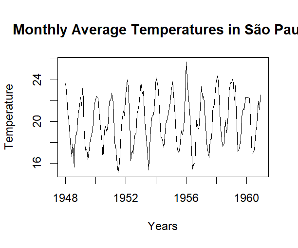

# Analysis of São Paulo's Monthly Temperatures with SARIMA Models (temp_mensuelles.R)

## Introduction

This project aims to analyze the monthly average temperatures recorded in São Paulo between 1948 and 1960. Through a structured workflow, this script explores the data, identifies suitable SARIMA (Seasonal AutoRegressive Integrated Moving Average) models, and forecasts temperatures for the year 1960. The approach incorporates advanced time series modeling techniques, along with bootstrap validation, to ensure reliable results.

This script is designed for educational and professional purposes, demonstrating how time series analysis tools can be applied to real-world climatic data to provide actionable insights.

---

## Key Features

1. **Data exploration and visualization:**
   - Analysis of São Paulo's monthly average temperatures.
   - Visualization of trends and empirical correlations.
     


   **Insight:**  
- The data exhibit strong seasonality, suggesting that a seasonal model like SARIMA is appropriate for forecasting.


2. **Stationarity and differencing:**
   - Stationarity tests to assess the properties of the series.
   - Transforming the series to make them stationary if required.

3. **Data splitting:**
   - Separation into training (`temperature.train`) and testing (`temperature.test`) datasets.

4. **SARIMA modeling:**
   - Proposing multiple SARIMA models based on data properties.
   - Model diagnostics to evaluate their validity.

5. **Model validation:**
   - Comparing models using information criteria (AIC and BIC).
   - Selecting the best model for forecasting.

6. **Forecasting and result visualization:**
   - Predictions for the year 1960.
   - Visualization of forecasts compared to actual data.

7. **Bootstrap for prediction intervals:**
   - Using non-parametric bootstrap to estimate prediction uncertainties.
   - Generating 95% confidence intervals for predictions.

8. **Error analysis:**
   - Calculating and analyzing errors between forecasts and actual observations.

---

## Prerequisites and Installation

This script is written in **R** and requires the following packages:

- `forecast`
- `tseries`
- `boot`

To install the required packages, run the following command in R:
```R
install.packages(c("forecast", "tseries", "boot"))
```

The dataset (in CSV format) must be placed in the R working directory and named `Sao_Paulo.csv`. The dataset should include a column named `Temperature` containing the monthly temperatures.

---

## Script Structure

The script is organized into several steps:
1. Loading and exploring the data.
2. Stationarity tests and transformations if needed.
3. Splitting into training and testing datasets.
4. SARIMA modeling and diagnostics.
5. Forecasting and validating the results.
6. Using bootstrap for robust estimates.
7. Visualizing results and error analysis.

Each section is documented in the script to ensure clarity.

---

## Conclusion

This project highlights the use of SARIMA models to analyze and forecast climatic time series data. The results provide quantitative insights into São Paulo's temperatures and demonstrate the effectiveness of SARIMA approaches for forecasting in climate studies.

By combining rigorous analysis, in-depth diagnostics, and robust validation techniques, this project serves as a practical example of applying data science to real-world problems. The script can serve as a foundation for similar analyses in other contexts.

---

## Author

**Hervé Boutrin**  
Data Scientist specializing in machine learning, predictive modeling, and advanced data analysis. For more information or collaboration opportunities, please visit my [professional profile](https://www.malt.fr/profile/herveboutrin).

